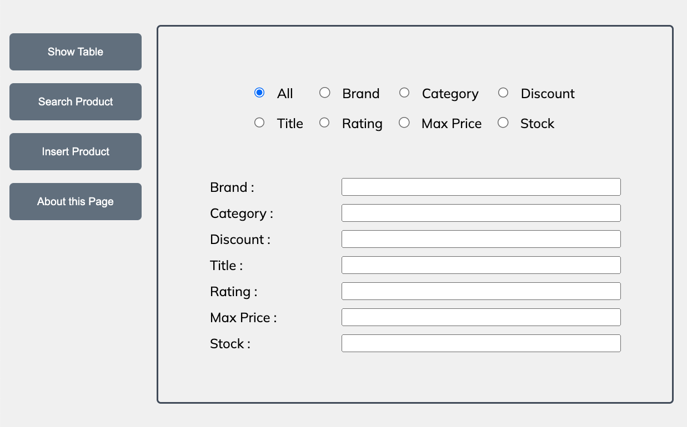
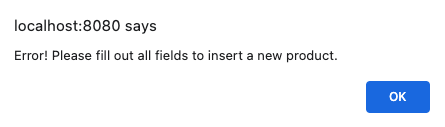

# EAD-Lab-4 - Mongoose and MongoDB
This assignment is about using **Mongoose** and **MongoDB** to create an online catalogue
of products.  
The catalogue of products can be downloaded from the following URL: https://dummyjson.com/products.  

  

## README File
My GitHub repo is https://github.com/jinantonic/EAD-Lab-4. 
You can find the detailed README file at https://github.com/jinantonic/EAD-Lab-4/blob/main/README.md. 
This file contains clearer instructions on how to navigate my website and the parts that I have accomplished.

  

## My solution

In the **server.js** file, the port number is set as **8080**.

 

Run **node public/server.js** on the terminal and check if a node server is running.

 

 
Once it is running successfully, go to http://localhost:8080/index.html on the browser to see the website.

 

This is the first look at the website. The main page consists of **4 buttons** on the left side, and **8 radio buttons** on the right side. 

 

When the radio button is clicked, it will display the corresponding search box so that the user can search for the products using any search filter.

 

Clicking the **All** radio button enables users to search for products that meet specific criteria. 

 

### Homepage
#### Show Table Button

Clicking the **Show Table** button will retrieve and display all the products along with their information on the table.

 

By clicking any **table row**, it will redirect you to the page where you can see all the details of the product of the corresponding row. The arrow buttons below the image will help you navigate the product images. It is handy since it displays the current picture index / total number of pictures in the box between those arrow buttons. 

 

#### Search Product Button

Moving onto the second button, select one of the radio buttons and enter the corresponding input text. 

 

Then click the **Search Product** button and it will return the result which has the brand as "Apple".

 

It also allows the users to search for products using multiple search options by clicking **All** button. 

 

As you can see, it is returning the correct result of products whose Brand contains "App", Category contains "Sm" and the Price is less than 900. 

 

If there is no matching product, it displays an error message along with the empty table result below.

 

#### Insert Product Button

Then we move on to the **Insert Product** button, which will direct you to **indexDetail.html** page.

 

### Insert product page

This is the **indexDetail.html** page, which allows users to enter new products into the table.

 

Enter the details and click **Insert** button.

 

 
It will display a **success** message when there is no error, and an **error** message if there is an error. After clicking **ok**, it will redirect you to the main home page. 

 

Click the **show table** button on the homepage and you can see the new product is added to the end of the table.

 

#### Home & About this Page Button

On the insert product page, the rest buttons are **Home** and **About this Page**. They are pretty straightforward, the **Home** button will bring you to the main page and **About this Page** will bring you to the page that explains briefly about the page.

 

### Product detail page

Going back to the main page, clicking the table row will bring you to the product page corresponding to the table row's product detail. You can click any shell on the table row.

 

 
This page includes every detail of the product.

 

 
The arrow buttons below help navigate the product images and the text box between those arrows displays the current image index along with the total number of images.

 

#### Update Button

Modify any detail of the product and click **Update** button on the left. 

 

 
It will display a **success** message when there is no error, and an **error** message if there is an error. After clicking **ok**, it will redirect you to the main home page. 

 

Then click the **show table** button on the homepage and the product is modified using the new details.

 

#### Delete Button

If you want to remove the product from the list, you can open the product detail by clicking the product's table row. And then click **Delete** button on the left side.

 

 
It will display a success message when there is no error and it will redirect you to the main home page once it's done.

 

Check the result by clicking the **show table** button on the homepage, the product is successfully removed from the list.

 

#### Insert button

**Insert** button also works on this page if the user wants to use the original data of the product or modify it and upload it as a new product.

 

#### Home & About this Page Button

The rest buttons are **Home** and **About this Page**. They do the exact same thing as the ones on the insert product page, the **Home** button brings you to the main page and **About this Page** brings you to the About page.

 

### 404 page

This is a custom HTML page for a **404 error**. If the user types a wrong address, this page will get displayed indicating that the error has been made, and the user can go back to the main page by clicking the **homepage**.

  

This is the end of my assignment. Thank you for your time.